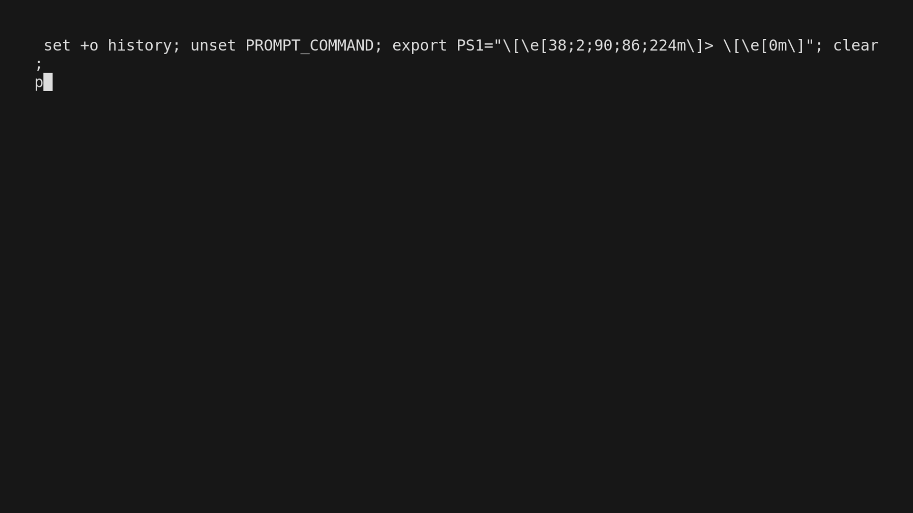

# ML_Transcribe
commit
## Current state of project
1. pull audio from a spotify link
2. for said audio seperate it into 5 stem model
3. clean it up a bit
4. pull out highest average amplitude section of the split audio. (what part of the song has a lot of piano...)
5. Play the selected audio and record audio as the user hums/sings/something along
6. Take selected audio and generate mel spectrograms.
7. Feed those into a cnn for image classification (aka sound classification)
### TODO
1. Note Transcription (JUD)
2. Many parameter runs (programatic) (JONAH)
    - Graph results 
3. Re-test on a large Dataset (JUD)
4. Windows tests (JUD/JONAH)
5. Python modularize (JONAH)
    - IF NOT DO SOME KIND OF SETUP.SH TO MAKE IT EASY FOR GRADER TO RUN.
## Setup
I'm assuming you run python3
You need to install
- spleeter
```
pip install spleeter
```
- spotdl
```
pip install spotdl
```
- pyaudio
```
sudo apt-get install python3-pyaudio
```
```
sudo apt install portaudio19-dev
```
- pytorch
``` 
pip install torch
```

The code uses a symlink to this repo.
In terminal go to one level above the repo and link it
On linux in bash
```
sn -s $(pwd)/ML_Transcribe /ML_Transcribe
```
Or you can just manually do the full path without the pwd thing.

### Running on windows
On windows symlinks are a pain. 
I have the code try to find your full path and set up the config based off of that. 
*Should* work out of the box. 

## repo structure
For each folder
- config
    - config.json for program behavior. Where to route .mp3s etc.
    - put stuff here as needed
- data
    - some folder name (active folder)
        - where the seperated audio lands. 
        - mp3s
            - download mp3s to a folder specified by user input here.
    - archive
        - prior runs (differentiated by timestamp if same folder name)
- src
    - python app
    - utils module

## How to run
There is a makefile if you want
- clear out the data folder
```
make clean
```
- do a run (WILL CALL CLEAN AS WELL)
```
make run
```

You can obviously not use the makefile
```
python src/app.py --help
```


## Disclamers
Sometimes spleeter fails and not every file survives running. There is no guarantee that a playlist of 30 songs results in a dataset of 30 songs. 
